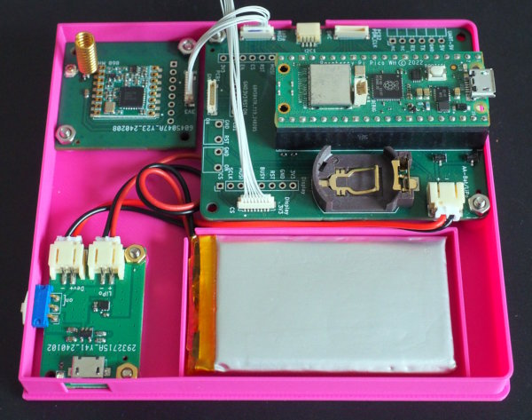
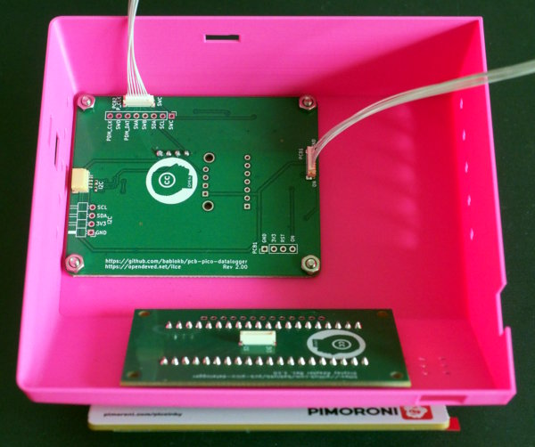
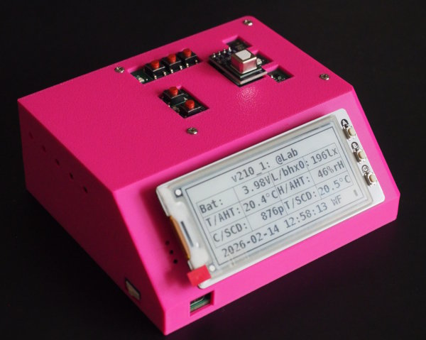

A case for the Pico-Datalogger v2
=================================

This project provides the 3D-design-files (OpenSCAD) for a case
for the Pico Datalogger (see https://github.com/bablokb/pcb-datalogger-v2).

The case is available for two versions: one for the very first
iteration of the v2-pcb with size 46x60mm (with revision 0.94, gray
buttons), and one for the second iteration with size 56x70mm (with
revision 2.10, red buttons).

Base with Pico, Lipo, Lipo-charger (front left) and LoRa-PCB (back
left):

Cover with sensor-PCB and display-adapter:

Finished assembly:

License
-------

[![CC BY-SA 4.0][cc-by-sa-shield]][cc-by-sa]

This work is licensed under a
[Creative Commons Attribution-ShareAlike 4.0 International
License][cc-by-sa].

[![CC BY-SA 4.0][cc-by-sa-image]][cc-by-sa]

[cc-by-sa]: http://creativecommons.org/licenses/by-sa/4.0/
[cc-by-sa-image]: https://licensebuttons.net/l/by-sa/4.0/88x31.png
[cc-by-sa-shield]:
https://img.shields.io/badge/License-CC%20BY--SA%204.0-lightgrey.svg
